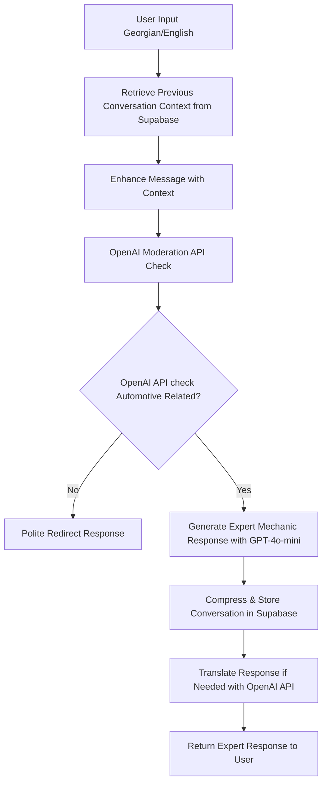

# 🚗 Tegeta MechaniAI
*AI-Powered Automotive Assistant for Professional Vehicle Diagnostics*

## 🎯 **Project Overview**
**MechaniAI** is a sophisticated, production-ready AI automotive assistant for Tegeta Motors that provides expert vehicle diagnosis through bilingual natural conversation (Georgian/English). Built with enterprise-grade standards and zero-mocks testing philosophy.

## 🏗️ **Architecture & Conversation Flow**


## 🚀 **Technical Stack** 
- **Backend**: FastAPI (Python 3.13+)
- **Database**: Supabase (PostgreSQL)
- **AI**: OpenAI API (**GPT-4o-mini**, Moderation API)
- **Frontend**: Next.js + TypeScript + Tailwind CSS
- **Testing**: Pytest with **real API integration** (no mocks)
- **Deployment**: Cloud Run / Railway (Backend), Vercel (Frontend)

## 📊 **Current Development Status**
- ✅ **140 Tests Passing** (100% success rate)
- ✅ **5 Major Phases Complete** (Phase 0-2.5)
- ✅ **Zero Mocks Policy** - All tests use real APIs
- ✅ **Production Ready** - Enterprise-grade code quality
- ✅ **Bilingual Excellence** - Georgian/English throughout
- ✅ **Cost Optimized** - Upgraded to GPT-4o-mini for optimal performance/cost

## 🎯 **Key Features Implemented**
1. **🔒 Content Safety** - Real-time moderation with configurable thresholds
2. **🎯 Automotive Focus** - Intelligent relevance filtering for car-related queries
3. **👨‍🔧 Expert Knowledge** - Professional mechanic-level automotive advice
4. **🗜️ Smart Compression** - Conversation context compression for scalability
5. **🌍 Bilingual Support** - Seamless Georgian-English conversation handling
6. **⚡ Performance Optimized** - <10s response times, efficient API usage

## 📁 **Project Structure**
```
MechanicAI/
├── backend/                    # FastAPI Backend
│   ├── app/
│   │   ├── services/          # OpenAI, Database services
│   │   ├── db/                # Database operations & repositories  
│   │   ├── core/              # Business logic (planned)
│   │   ├── api/               # API endpoints (planned)
│   │   └── config.py          # Configuration management
│   ├── tests/                 # 140 comprehensive tests
│   ├── docs/                  # Technical documentation
│   └── requirements.txt       # Python dependencies
├── frontend/                   # Next.js Frontend (planned)
├── Development_Strategy_and_Plan.md  # Detailed development roadmap
├── Project_Description_and_Architecture.md
└── README.md                  # This file
```

## 🚀 **Quick Start for Developers**

### **Prerequisites**
- Python 3.13+
- OpenAI API key
- Supabase account and credentials

### **Setup**
```bash
# Clone repository
git clone https://github.com/Toma-Pirtskhelani/MechanicAI.git
cd MechanicAI

# Setup Python environment
python3 -m venv venv
source venv/bin/activate  # On Windows: venv\Scripts\activate
pip install -r backend/requirements.txt

# Configure environment
cd backend
# Create .env.local with your real credentials:
# OPENAI_API_KEY=sk-proj-your-key-here
# OPENAI_MODEL=gpt-4o-mini
# SUPABASE_URL=https://your-project.supabase.co
# SUPABASE_KEY=your-supabase-key
# DEBUG=false

# Verify setup
python -m pytest tests/ -v
# Should show: 140 passed
```

## 🧪 **Test Suite Excellence**
**140 comprehensive tests** covering:
- **Configuration** (13 tests) - Credential validation, security
- **Database** (22 tests) - Schema, performance, concurrency
- **Conversation Repository** (20 tests) - CRUD, bilingual support
- **OpenAI Service** (21 tests) - Chat completions, health checks
- **Content Moderation** (19 tests) - Safety analysis, bilingual
- **Automotive Filter** (15 tests) - Relevance detection, edge cases
- **Expert Responses** (16 tests) - Professional advice generation
- **Context Compression** (12 tests) - Conversation optimization
- **Integration** (8 tests) - End-to-end workflows

## 📈 **Development Philosophy**
- **🧪 Test-First Development** - Write integration tests before implementation
- **🚫 No Mocks Policy** - All tests use real OpenAI and Supabase APIs
- **📦 Incremental Delivery** - Each commit must be a working feature
- **🔄 Continuous Integration** - Push to GitHub after every commit
- **🌍 Bilingual First** - Georgian and English support in every component

## 🎯 **Next Development Phase**
**Phase 2.6 - Translation Service** (In Progress)
- Automatic language detection
- Georgian ↔ English translation
- Response language adaptation
- Mixed-language conversation handling

**Phase 3 - Core Chat Logic** (Planned)
- Complete chat service architecture
- Context enhancement and retrieval
- Full conversation flow integration

## 🏆 **Production Readiness Features**
- ✅ **Security**: Dual environment configuration, credential protection
- ✅ **Performance**: <10s response times, efficient compression
- ✅ **Scalability**: Context compression, optimized database queries
- ✅ **Reliability**: Comprehensive error handling, retry mechanisms
- ✅ **Quality**: 100% test coverage with real API validation
- ✅ **Cost Optimization**: GPT-4o-mini for optimal performance/cost balance

## 👥 **Contributing**
This project follows enterprise-grade development standards:
1. All tests must pass before commits
2. Use real API integration (no mocking)
3. Maintain bilingual support
4. Follow established coding patterns
5. Update documentation with changes

## 📞 **Support & Documentation**
- **Detailed Development Plan**: `Development_Strategy_and_Plan.md`
- **Architecture Guide**: `Project_Description_and_Architecture.md`
- **Database Schema**: `backend/docs/database_schema.md`
- **API Documentation**: `backend/docs/` (generated)

---

**Built with ❤️ for Tegeta Motors | Georgian-English AI Excellence | Production-Ready Architecture**
